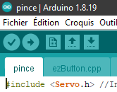

# Code Final - Option Pince

Code final du mod "Pince" proposant de prendre le controlle complet de la machine via une application sur smartphone

## Flasher le robot

### 0. Installer le logiciel Arduino
Pour flasher le code, vous devrez installer arduino ()

### 1. Branchez l'arduino par USB
Vous devez débrancher le bluetooth (module bleu), prenez bien note de la manière dont tout est branché avant (prenez un photo, cela ne sera probablement pas de trop)

Si la pile est branché, débranchez la.

Branchez ensuite le cable USB sur le port de l'arduino et au PC, on est parré !

### 2. Récuperer le code

Une fois fait, téléchargez le code par ici (https://github.com/CPB-Workshop/Robot1/archive/refs/heads/main.zip)

Dezippez le et allez dans le dossier code / final / pince et double cliquez sur pince.ino

### 3. Réglage avant de flasher

Dans la section "outils", vous devez choisir :
* Type de carte : "Arduino Nano"
* Processeur: ou bien "ATMega328P" ou bien  "ATMega328P (Old bootloader)" cela dépend du microOS dans l'arduino, pas distinguible physiquement, a changer sur lors du flash cela ne marche pas
* Port: "ComX" X étant variable d'un pc a l'autre, d'un Port USB a l'autre. Normalement si vous avez branché avant d'ouvrir l'onglet vous devriez en voir au moins un. Si plus d'un, tentez de débrancher et rouvrir l'onglet pour voir lequel aurais disparus et qui serait donc votre Arduino

Cela donne en somme ceci a la fin (Old bootload ou port Com près)


### 4. Flashez !

Utilisez la flèche pour verrifier le contenu du code, si aucune erreur n'apparait en rouge en dessous, utilisez la fleche pour transferrer le code



### 5. Rebranchez...

Débranchez l'USB, rebranchez le bluetooth, rebranchez la batterie, on est partis !

### 6. L'app mobile

Pour le controller par bluetooth via votre smartphone android, il faut télécharger l'application RemoteXY

### AppStore


### G-Play


et ajouter une nouvel appareil : le + en haut a droite 
puis bluetooth classic et vous devriez voir un appareil comme HC-05 ou HC-06 ou le nom que vous aurez choisis pour votre Robot.

Dès lors le robot est connecté et vous pouvez découvrir l'interface de controle pour expérimenter le code et vos modifs. Happy coding ;)

# TROUBLESHOOTING

## Robot qui avance pas droit ou recule
En cas de probleme de sens des moteurs (le robot tourne au lieux de rouler droit/recule) ont peut modifier le code a loisir sur la partie suivante :

```C++
    void lancerRotationMoteurPontA(bool marcheAvant, char vitesse) {
        digitalWrite(borneIN2, marcheAvant ? LOW : HIGH);    // inversion LOW et HIGH, Idem en dessous pour inverser le comportement d'une roue            
        digitalWrite(borneIN1, marcheAvant ? HIGH : LOW);
        
        analogWrite(borneENA, vitesse);       // Active l'alimentation du moteur 1
    }
    //[...]
    void lancerRotationMoteurPontB(bool marcheAvant, char vitesse) {
        digitalWrite(borneIN3, marcheAvant ? LOW : HIGH);    // inversion LOW et HIGH, Idem en dessous pour inverser le comportement d'une roue            
        digitalWrite(borneIN4, marcheAvant ? HIGH : LOW);
        
        analogWrite(borneENB, vitesse);       // Active l'alimentation du moteur 2
    }
```